# Project Management Module - Visual Diagrams

This document contains visual diagrams for the Project Management module using Mermaid syntax.

---

## 1. Entity Relationship Diagram (ERD)

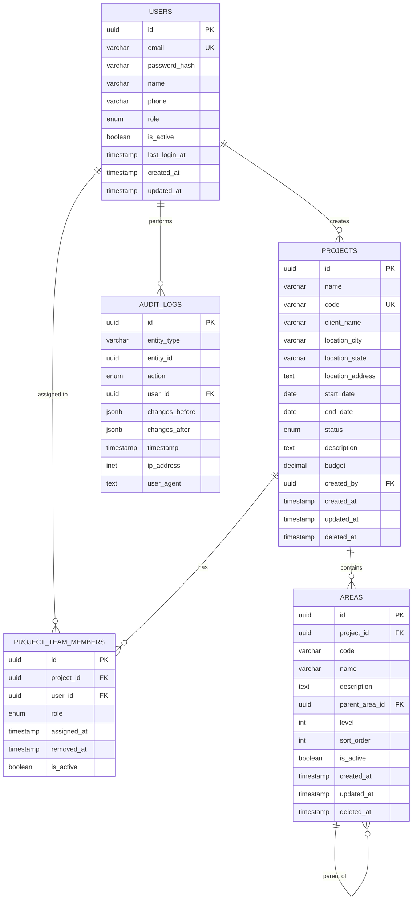

---

## 2. System Architecture Diagram

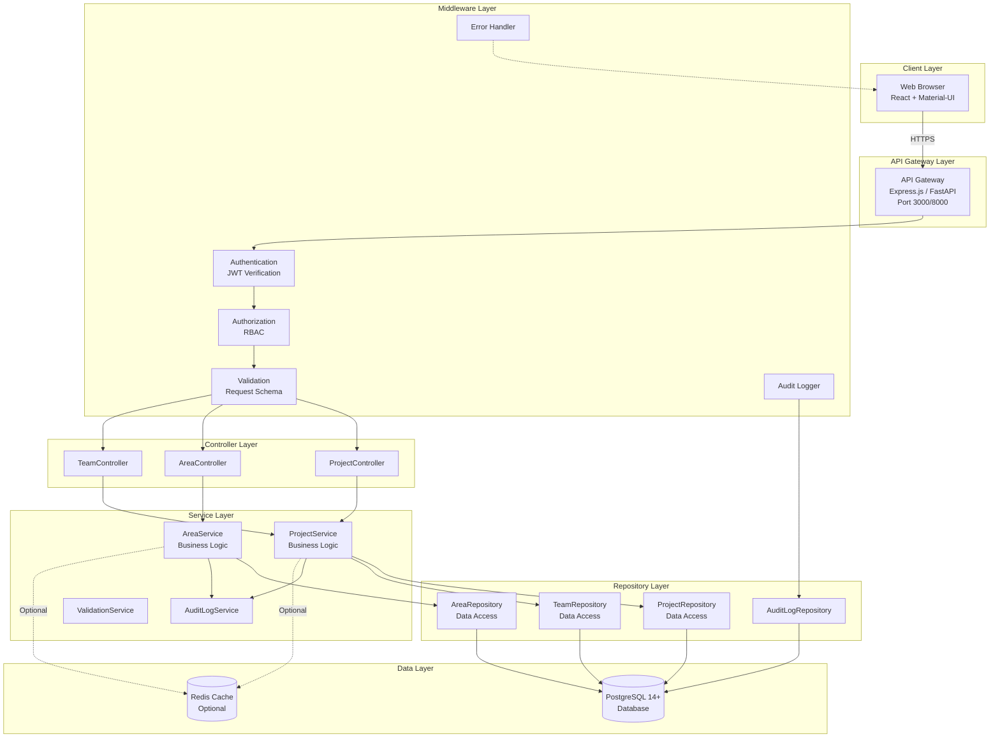

---

## 3. Project Creation Flow

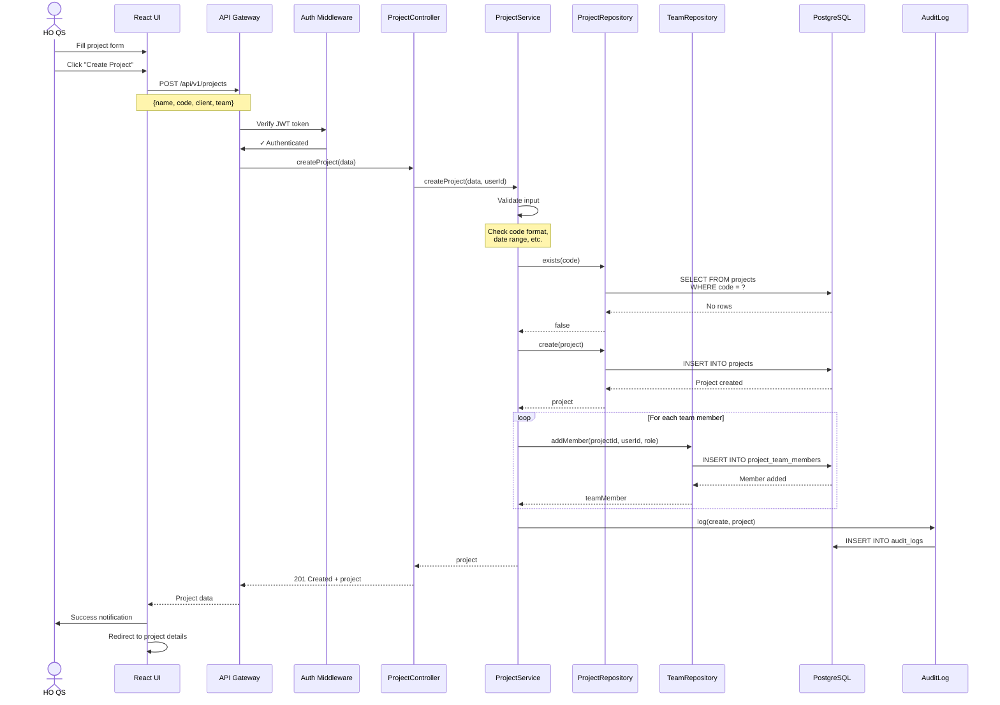

---

## 4. Area Hierarchy Building

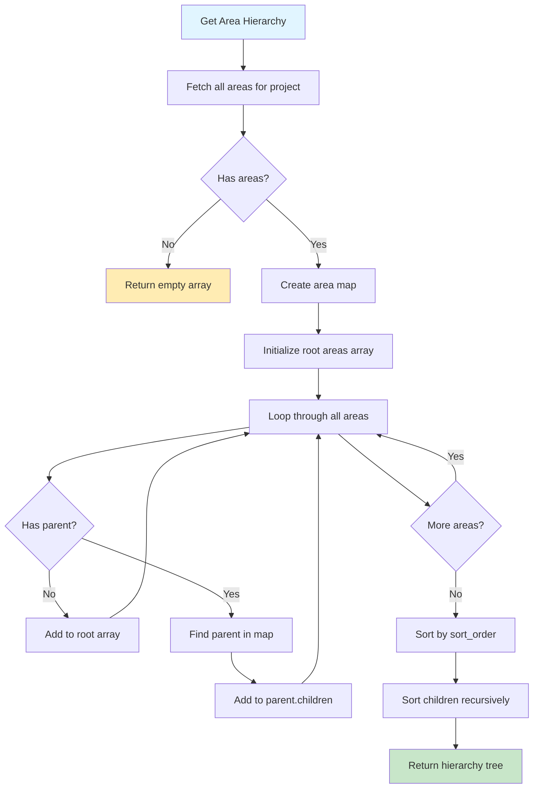

---

## 5. Authorization Flow

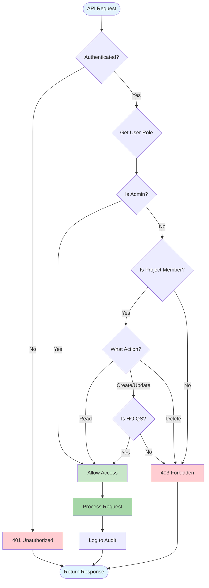

---

## 6. Database Schema Relationships

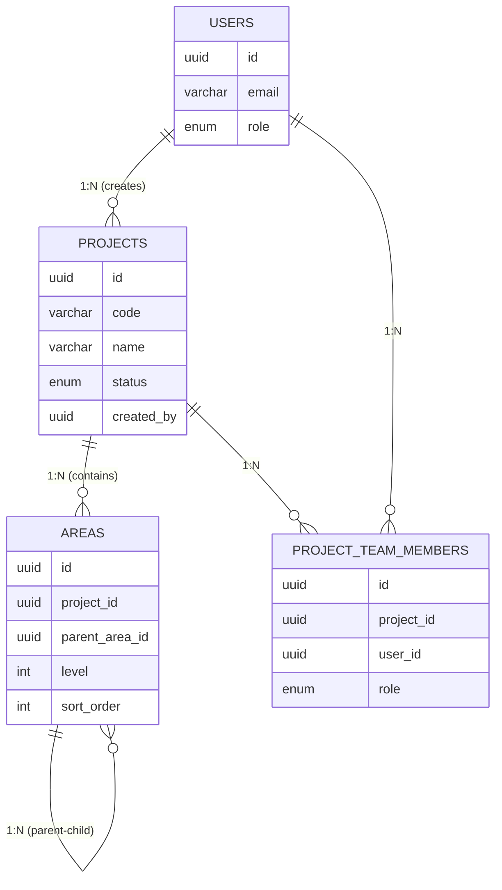

---

## 7. Project Lifecycle States

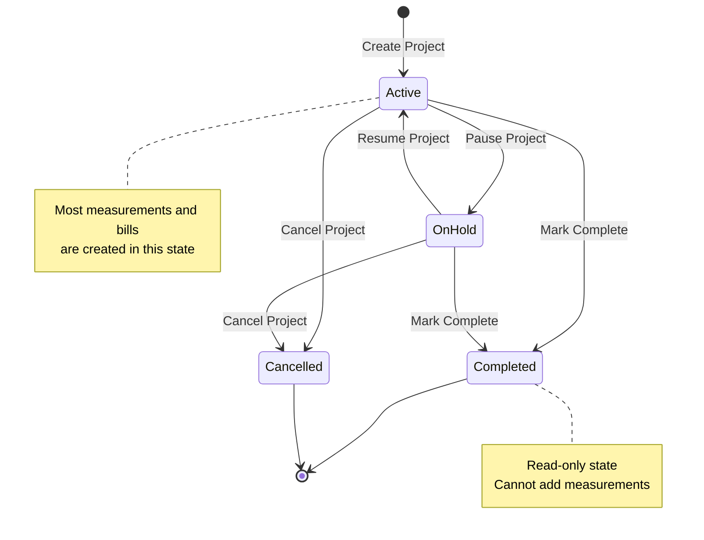

---

## 8. Area Hierarchy Example

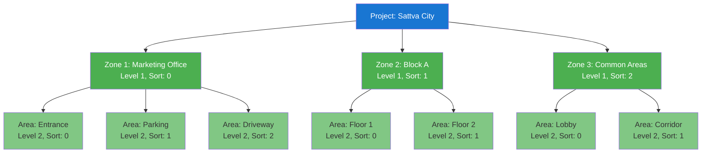

---

## 9. API Request/Response Flow

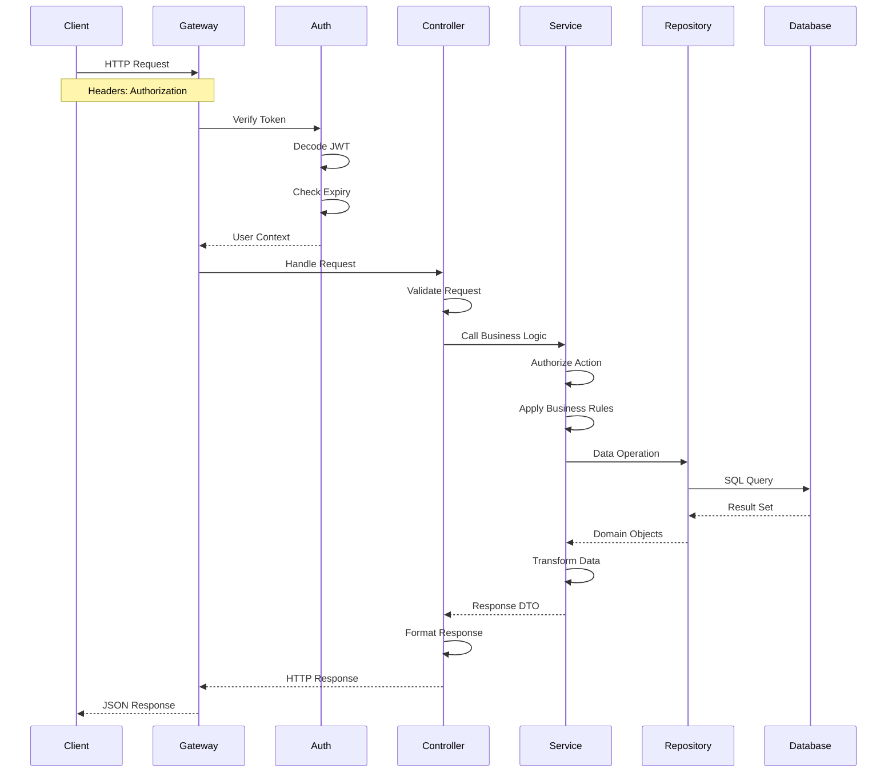

---

## 10. Frontend Component Hierarchy

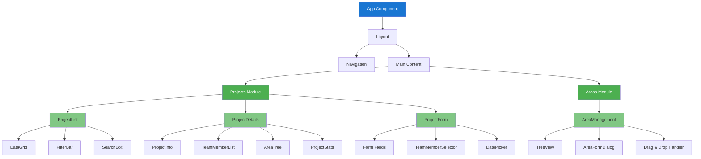

---

## 11. Test Coverage Strategy

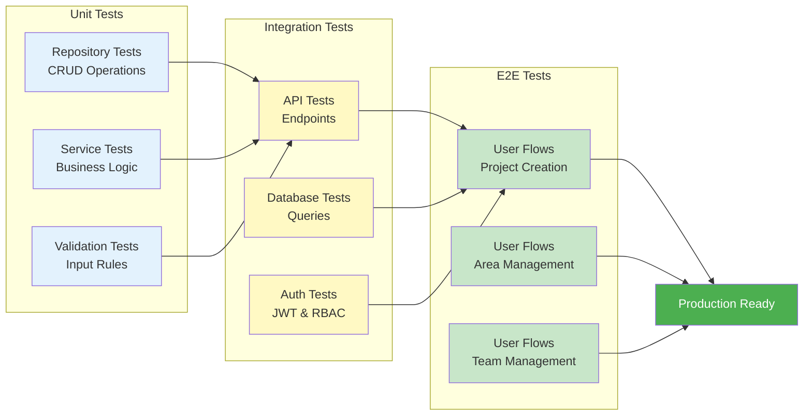

---

## 12. Deployment Pipeline

```mermaid
graph LR
    DEV[Developer]
    
    DEV -->|git push| REPO[GitHub<br/>Repository]
    
    REPO -->|webhook| CI[CI Pipeline<br/>GitHub Actions]
    
    CI --> LINT[Linting<br/>ESLint/Pylint]
    LINT --> BUILD[Build<br/>TypeScript/Python]
    BUILD --> UT[Unit Tests<br/>>80% Coverage]
    UT --> IT[Integration Tests<br/>With Test DB]
    IT --> E2E[E2E Tests<br/>Selenium/Cypress]
    
    E2E -->|Success| STAGING[Deploy to<br/>Staging]
    
    STAGING --> QA[QA Testing<br/>Manual Verification]
    
    QA -->|Approved| PROD[Deploy to<br/>Production]
    
    PROD --> MONITOR[Monitoring<br/>Logs & Metrics]
    
    E2E -->|Failure| NOTIFY[Notify Team<br/>Slack/Email]
    QA -->|Rejected| NOTIFY
    
    style DEV fill:#e3f2fd
    style CI fill:#fff9c4
    style STAGING fill:#ffecb3
    style PROD fill:#c8e6c9
    style NOTIFY fill:#ffcdd2
```

---

## How to View These Diagrams

### Option 1: GitHub (Automatic Rendering)
GitHub automatically renders Mermaid diagrams in Markdown files. Just view this file on GitHub.

### Option 2: VS Code
Install the "Markdown Preview Mermaid Support" extension.

### Option 3: Online Viewer
Copy the Mermaid code and paste it into: https://mermaid.live/

### Option 4: Documentation Site
If you're using Docusaurus, MkDocs, or similar, they support Mermaid natively.

---

## Diagram Legend

**Colors:**
- 🔵 Blue: Entry points, user-facing
- 🟢 Green: Success states, allowed actions
- 🟡 Yellow: Processing, intermediate states
- 🔴 Red: Error states, denied actions
- ⚪ White/Gray: Neutral, data entities

**Shapes:**
- Rectangle: Component, process
- Diamond: Decision point
- Circle: State, endpoint
- Cylinder: Database
- Cloud: External service

---

**Document Version:** 1.0  
**Last Updated:** February 15, 2026
